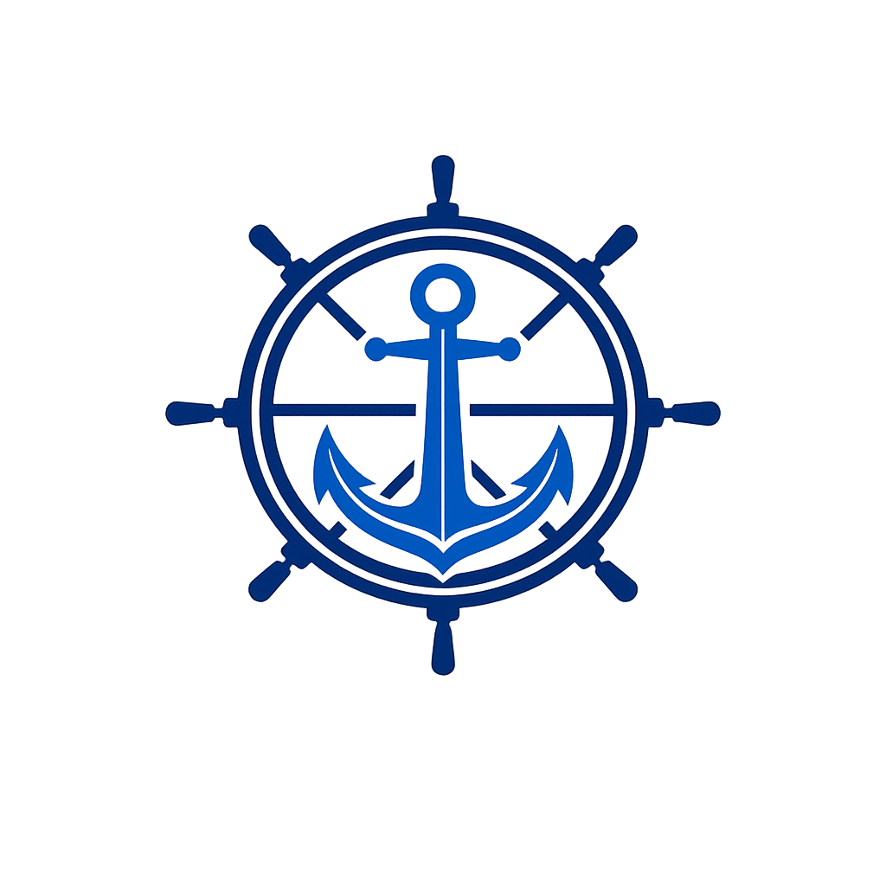

# LH Nautical — Desafio Técnico Indicium

<p align="center">
  
</p>

<p align="center">
  <strong>Pipeline de dados ponta a ponta · Análise de rentabilidade · Previsão de demanda · Sistema de recomendação</strong>
</p>

---

## Achado central

> Com custos de importação em USD convertidos pelo câmbio PTAX/BCB do dia de cada venda, a operação acumula **R$-139 milhões de prejuízo em 2 anos** sobre R$2,61 bilhões de receita. Margem real de **-5,3%** — invisível sem a integração com a API do Banco Central.

| Métrica | Valor |
|---|---|
| Receita total (2023–2024) | R$ 2,61 bilhões |
| Margem real | -5,3% |
| Produtos analisados | 150 |
| Clientes | 49 |
| Transações | 9.895 |
| Reajuste médio necessário | +24,5% |

| | |
|---|---|
|  |  |
| Receita cresce, resultado despenca com o câmbio | Nenhum produto sobrevive ao câmbio atual de R$6,19 |

---

## Stack

<p align="center">
  
  &nbsp;&nbsp;
  
  &nbsp;&nbsp;
  
  &nbsp;&nbsp;
  
  &nbsp;&nbsp;
  
  &nbsp;&nbsp;
  
  &nbsp;&nbsp;
  
  &nbsp;&nbsp;
  
</p>

Pipeline **Bronze → Silver → Gold** no Databricks com Delta Lake e Unity Catalog. Desenvolvimento local via `databricks-connect + VS Code` com execução remota no Serverless.

---

## Ambiente Databricks

| | |
|---|---|
|  |  |
| Workspace com os 10 notebooks do projeto | Unity Catalog: 14 tabelas Delta + 1 Volume |

---

## Dashboard interativo


6 KPIs reativos · evolução mensal com câmbio · ranking de produtos e clientes · forecast Jan–Jun/2025 · recomendação por cliente

**[🔗 https://lh-nautical-dashboard.streamlit.app](https://lh-nautical-dashboard.streamlit.app)**

```bash
streamlit run dashboard/streamlit_app.py
```

---

## O que foi entregue

| Etapa | Entrega |
|---|---|
| EDA | Diagnóstico de 4 bases brutas — problemas mapeados e documentados |
| Pipeline Silver | Datas, emails, categorias, histórico de custos — 100% tratado |
| Camada Gold | `gold_fct_vendas` — margem real por transação com custo USD × PTAX |
| Análise de vendas | Break-even cambial por produto, Pareto de prejuízo, reajuste necessário |
| Análise de clientes | RFM × margem real, ranking de rentabilidade, distribuição geográfica |
| Previsão de demanda | 5 modelos comparados · Naive Sazonal vence com MAPE 8,1% |
| Recomendação | 3 abordagens + variante ajustada por margem · 100% de cobertura (49/49) |
| Apresentação | Relatório executivo PDF + dashboard Streamlit |

Checks de qualidade com **PASS em 100% das verificações** (notebooks 05 a 10).

---

## Como reproduzir

**Pipeline (Databricks Workspace):**
```
01_bronze → 02_silver → 03_gold
```

**Análise (via databricks-connect ou Databricks UI):**
```
04_eda → 05_tratamento → 06_analise_vendas → 07_analise_clientes
→ 08_previsao_demanda → 09_recomendacao → 10_apresentacao_final
```

---

## Contato

**Autor:** Antonio Sergio Castro de Carvalho Junior
**Repositório:** https://github.com/ASCCJR/Indicium_LH_Nautical
