<div class="cover-page">
  <div class="cover-badge">DESAFIO TÉCNICO INDICIUM</div>
  <div class="cover-brand">LH NAUTICAL</div>
  <div class="cover-title">Relatório Executivo</div>
  <div class="cover-subtitle">Análise de Rentabilidade, Previsão de Demanda<br>e Sistema de Recomendação</div>
  <div class="cover-divider"></div>
  <div class="cover-meta">
    <div class="cover-meta-row"><span class="cover-meta-label">Autor</span><span class="cover-meta-value">Antonio Sergio Castro de Carvalho Junior</span></div>
    <div class="cover-meta-row"><span class="cover-meta-label">Data</span><span class="cover-meta-value">Março 2026</span></div>
    <div class="cover-meta-row"><span class="cover-meta-label">Repositório</span><span class="cover-meta-value"><a href="https://github.com/ASCCJR/Indicium_LH_Nautical" target="_blank">github.com/ASCCJR/Indicium_LH_Nautical</a></span></div>
    <div class="cover-meta-row"><span class="cover-meta-label">Dashboard</span><span class="cover-meta-value"><a href="https://lh-nautical-dashboard.streamlit.app" target="_blank">lh-nautical-dashboard.streamlit.app</a></span></div>
  </div>
  <div class="cover-stack">
    <div class="cover-stack-label">Stack</div>
    <div class="cover-stack-badges">
      <div class="stack-item">
        <div class="stack-logo-box"></div>
        <span class="stack-badge">Databricks</span>
      </div>
      <div class="stack-item">
        <div class="stack-logo-box"></div>
        <span class="stack-badge">Delta Lake</span>
      </div>
      <div class="stack-item">
        <div class="stack-logo-box"></div>
        <span class="stack-badge">PySpark</span>
      </div>
      <div class="stack-item">
        <div class="stack-logo-box"></div>
        <span class="stack-badge">Unity Catalog</span>
      </div>
      <div class="stack-item">
        <div class="stack-logo-box"></div>
        <span class="stack-badge stack-badge--light">Streamlit</span>
      </div>
      <div class="stack-item">
        <div class="stack-logo-box">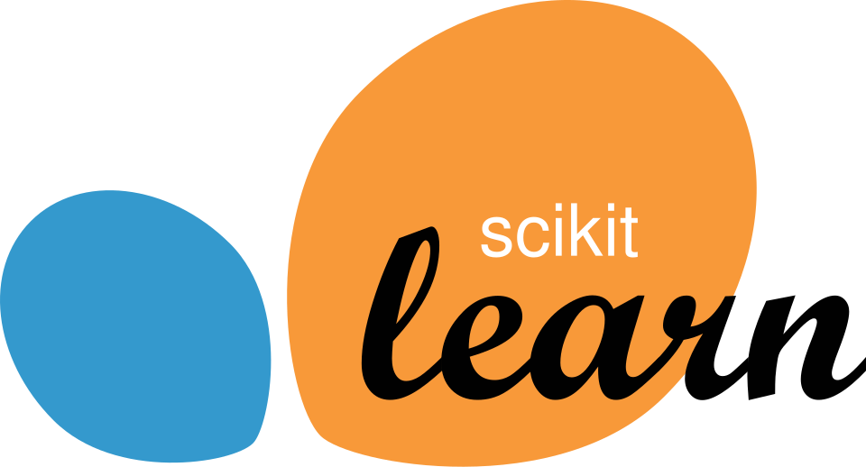</div>
        <span class="stack-badge stack-badge--light">scikit-learn</span>
      </div>
      <div class="stack-item">
        <div class="stack-logo-box"></div>
        <span class="stack-badge stack-badge--light">Prophet</span>
      </div>
      <div class="stack-item">
        <div class="stack-logo-box"></div>
        <span class="stack-badge stack-badge--light">BCB/PTAX</span>
      </div>
    </div>
  </div>
</div>

## 1. Resumo Executivo

### Contexto
A LH Nautical é uma empresa de varejo náutico com loja física em Florianópolis e e-commerce nacional. O cenário descrito no desafio: controle de estoque em planilhas manuais, banco de dados do e-commerce desconectado do sistema financeiro, e decisões tomadas sem dados consolidados.

O desafio foi estruturar uma jornada de dados completa a partir de quatro bases brutas. A integração com a API do Banco Central (PTAX/BCB) como quinta fonte foi a decisão analítica que revelou a crise real: o faturamento cresceu +2,5% em 2024, mas o câmbio subiu +8% no mesmo período — e a margem real, quando calculada com o custo de importação convertido pela taxa do dia de cada venda, é de **-5,3%**.

### Escopo entregue
- EDA e diagnóstico das 4 bases de dados
- Pipeline Medallion (Bronze → Silver → Gold) em Databricks com Delta Lake
- Análise de vendas com margem real por câmbio histórico e break-even cambial por produto
- Análise de clientes com RFM, geolocalização e ranking de lucratividade real
- Previsão de demanda com 5 modelos comparados (MAPE 8,1% no melhor)
- Sistema de recomendação com 3 abordagens + variante ajustada por margem
- Dashboard interativo (Streamlit)

> 🔷 **Stack nativo Databricks:** Delta Lake · PySpark · Unity Catalog · Serverless · databricks-connect — pipeline compatível com o stack Databricks nativo.

### Achado central
Com a metodologia de custo real — preço de compra em USD convertido pelo câmbio PTAX do dia da venda — a operação acumula **R$-139 milhões de prejuízo em 2 anos** sobre R$2,61 bilhões de receita. Margem real de **-5,3%**. O faturamento cresceu +2,5%, mas o câmbio subiu +8%, e o custo em BRL cresceu +10,5%. A operação está vendendo abaixo do custo de importação.

| | Receita | Custo | Resultado | Margem |
|---|---:|---:|---:|---:|
| 2023 | R$1.289M | R$1.306M | R$-17M | -1,3% |
| 2024 | R$1.322M | R$1.443M | R$-122M | -9,2% |
| **Total** | **R$2.610M** | **R$2.749M** | **R$-139M** | **-5,3%** |

### Mensagem para decisão
**Prioridade máxima: reajuste de preços antes de qualquer campanha de volume.**

> ⚠️ **Distinção crítica:** 23 produtos tiveram margem positiva ao longo do histórico (usando o câmbio variável do dia de cada venda). Porém, com o câmbio atual de R$6,19, **nenhum dos 150 produtos é lucrativo** — todos estão abaixo do break-even. O reajuste médio necessário é de +24,5%.

Enquanto os preços não forem corrigidos, a campanha imediata deve priorizar os 23 produtos historicamente menos negativos usando o sistema de recomendação ajustado por margem.

---

## 2. Metodologia Aplicada

### Pipeline de dados
1. **EDA:** mapeamento de 9.895 transações, 150 produtos, 49 clientes e 1.260 registros de custo histórico — identificados 4 problemas críticos: `sale_date` em 2 formatos (50/50), 39 variações de categoria, 7 produtos duplicados por `code` e 30/49 emails com `#` no lugar de `@`.
2. **Tratamento (Silver):** padronização de datas, correção de emails, extração de cidade/estado, normalização de categorias (39 variações → 3 canônicas), conversão de preços. Integração da quinta fonte: câmbio histórico BCB/PTAX via API (`olinda.bcb.gov.br/olinda/servico/PTAX/versao/v1`).
3. **Camada Gold:** `gold_fct_vendas` (Delta Lake) — cada linha de venda enriquecida com custo USD vigente por as-of join, taxa PTAX do dia, custo em BRL, lucro e margem real. Reconciliação financeira validada (delta < R$0,01).

### Premissa crítica
Sem conversão cambial histórica por data da venda, o resultado parece artificialmente melhor. A taxa USD/BRL variou de R$4,72 (mín.) a R$6,20 (máx.) no período. Usar taxa fixa ou tardia distorceria a margem de forma significativa. Este trabalho usa exclusivamente a taxa PTAX do dia de cada transação.

### Ambiente de execução

| | |
|---|---|
| 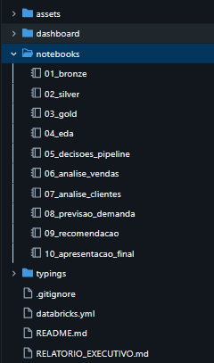 | 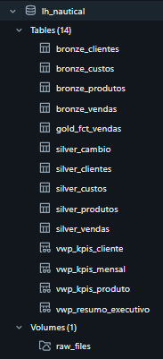 |
| Workspace com os 10 notebooks do projeto | Unity Catalog: 14 tabelas Delta (Bronze/Silver/Gold + views) + 1 Volume |

### Qualidade e reprodutibilidade
- Checks finais em todas as etapas analíticas: **PASS em 100% das verificações** (notebooks 05 a 10).
- Sem dados vazados: splits temporais em previsão e recomendação (cutoff Out/2024).

---

## 3. Evidências Visuais

### 3.1 Questão 4 — Distribuição e Ranking de Prejuízos por Produto

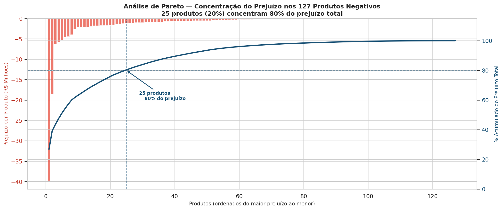

> **Onde encontrar:** `notebooks/06_analise_vendas.ipynb` — célula do gráfico Pareto (curva acumulada de perdas)

**Insight:** 25 produtos (20% dos 127 negativos) concentram 80% do prejuízo bruto de R$149M. O **Motor de Popa Volvo Hydro Dash 256HP** lidera o ranking absoluto com R$-39,8M (26,7% das perdas totais) — e também lidera em receita. Vender mais dele significa aumentar o prejuízo. A equipe comercial precisa deste gráfico na mesa antes de qualquer campanha de volume.

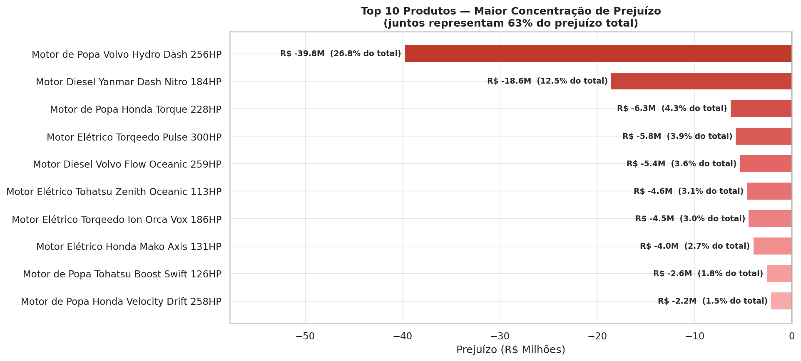

> **Onde encontrar:** `notebooks/06_analise_vendas.ipynb` — célula "Top 10 Produtos — Maior Concentração de Prejuízo"

**Insight:** Os 10 piores produtos juntos concentram **63% do prejuízo total**. Além do Volvo Hydro Dash 256HP, os outros 9 do ranking somam mais R$52M em perdas — todos da categoria **propulsão**, confirmando que é a linha mais exposta à variação cambial (produtos de maior valor unitário em USD).

---

### 3.2 Questão 5 — Clientes com Maior Lucro Acumulado

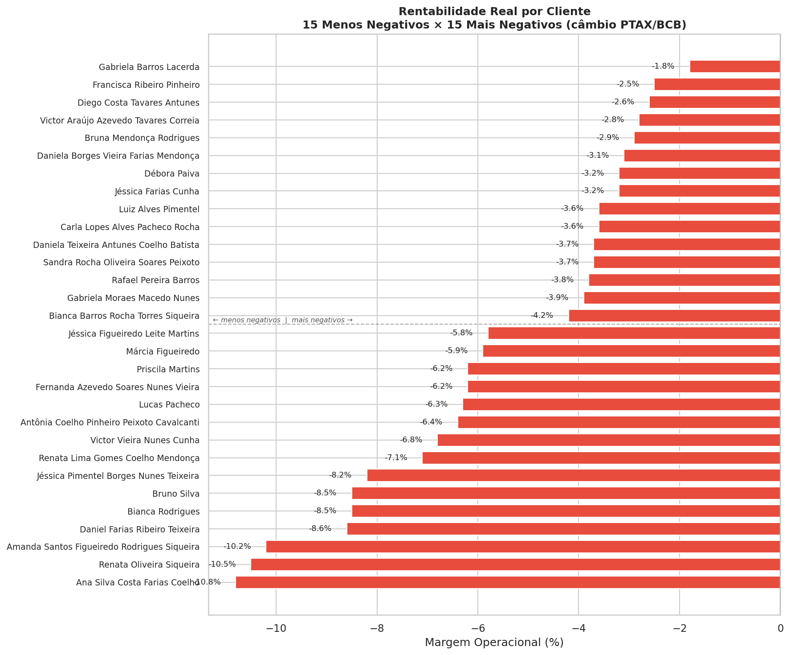

> **Onde encontrar:** `notebooks/07_analise_clientes.ipynb` — célula "Rentabilidade Real por Cliente — 15 Menos Negativos × 15 Mais Negativos (câmbio PTAX/BCB)"

**Insight:** Todos os 49 clientes operam com margem negativa — a crise é sistêmica, não específica de perfil de cliente. Márcia Figueiredo (PA) é a maior cliente em receita (R$72,2M), mas tem margem individual de **-5,93%** e ocupa a posição 36/49 no ranking de lucratividade. O ranking de receita não reflete rentabilidade.

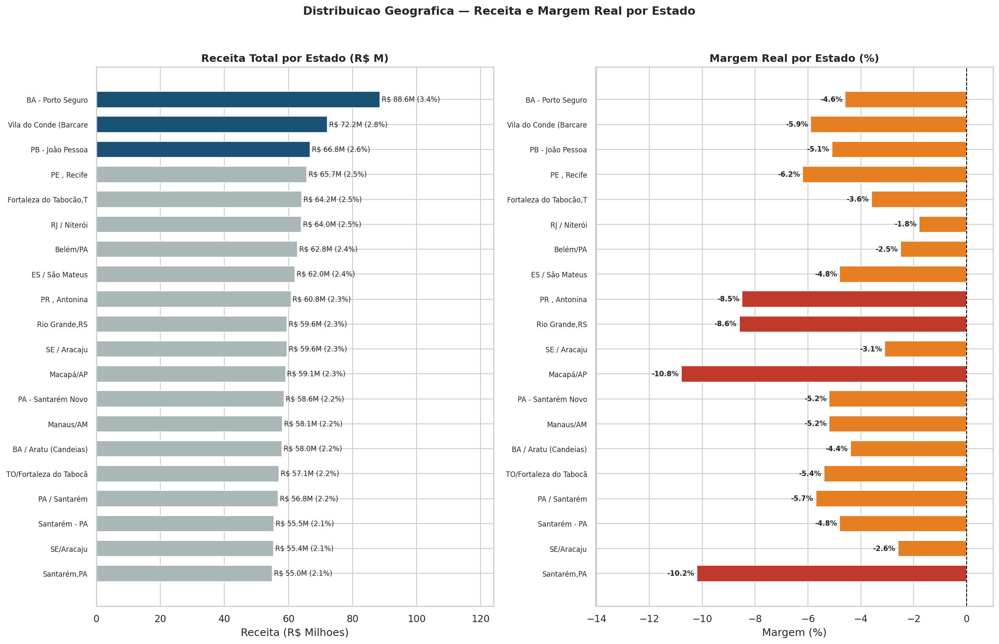

> **Onde encontrar:** `notebooks/07_analise_clientes.ipynb` — célula "Distribuicao Geografica — Receita e Margem Real por Estado"

**Insight:** PA, BA e TO concentram 35,4% da receita total (top 3 estados). O melhor estado em margem é **RJ com -1,8%** — ainda negativo, mas o menos crítico do portfólio. A crise é sistêmica: **todos os estados operam com margem negativa**. A recomendação de expansão em PA e BA é válida pelo volume, mas não pela rentabilidade — qualquer expansão geográfica deve vir acompanhada do reajuste de preços.

---

### 3.3 Questão 6 — Vendas Médias por Dia da Semana (com dias sem venda = R$0)

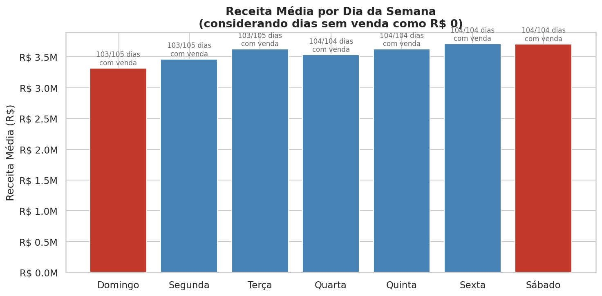

> **Onde encontrar:** `notebooks/07_analise_clientes.ipynb` — Seção 5 (barras coloridas dias úteis vs fim de semana)

**Insight:** Sexta-feira é o melhor dia para vendas (R$3,72M de média), seguida de Sábado praticamente empatado (R$3,71M). Domingo registra o menor volume (R$3,32M), mas vendas ocorrem em praticamente todos os dias do período — não há diferença expressiva entre dias úteis e fim de semana. A metodologia usa calendário completo de 731 dias com `LEFT JOIN`, garantindo que eventuais dias sem vendas sejam contabilizados como R$0.

---

### 3.4 Análises Adicionais

#### 3.4.1 Concentração por Categoria — Propulsão Domina

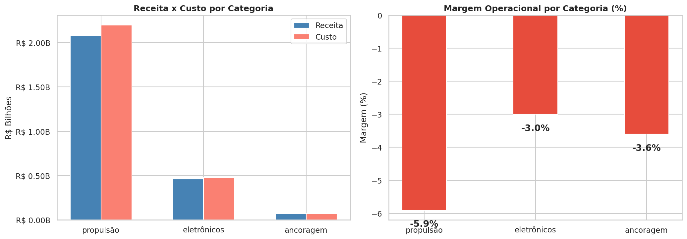

> **Onde encontrar:** `notebooks/06_analise_vendas.ipynb` — célula "Receita x Custo por Categoria" (dois painéis lado a lado)

**Insight:** Propulsão responde por **79,5% da receita total** — a empresa é, na prática, uma distribuidora de motores. O problema: é exatamente a categoria com maior destruição de margem em termos absolutos. As demais categorias têm volumes menores mas o padrão é o mesmo: todas negativas. Não há diversificação que compense — o problema é estrutural (câmbio vs preço de tabela).

---

#### 3.4.2 Evolução Mensal — Como o Câmbio Destruiu a Margem Mês a Mês

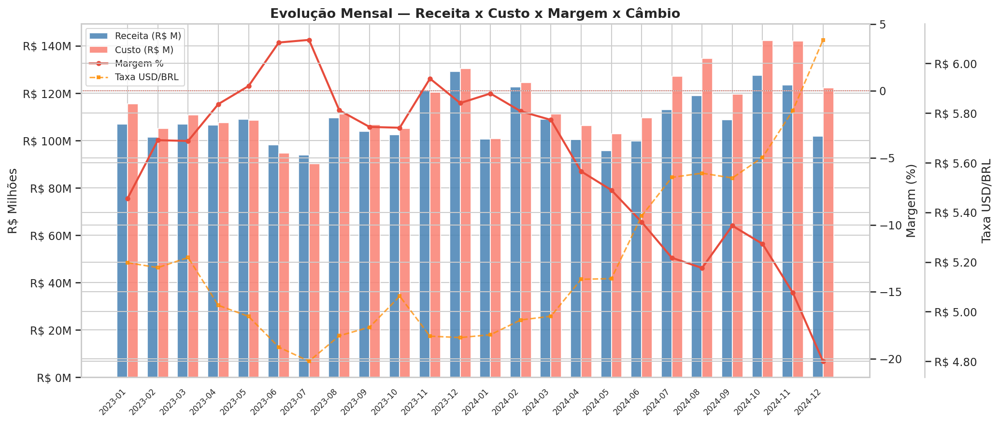

> **Onde encontrar:** `notebooks/06_analise_vendas.ipynb` — Seção 4, gráfico "Evolução Mensal — Receita x Custo x Margem x Câmbio"

Barras azul/salmão mostram receita e custo mensais; linha vermelha a margem%; linha laranja o câmbio no eixo direito. Os 4 meses azuis (Mai–Jul/2023 e Nov/2023) são os únicos com margem positiva — todos com câmbio abaixo de R$4,90. A partir de Abr/2024, com o câmbio acima de R$5,13, a margem nunca mais se recuperou.

---

#### 3.4.3 O Câmbio é o Culpado — Visão YoY

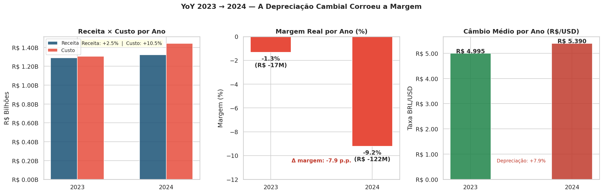

> **Onde encontrar:** `notebooks/06_analise_vendas.ipynb` — Seção 8, gráfico "YoY 2023 → 2024 — A Depreciação Cambial Corroeu a Margem" (3 painéis: Receita × Custo por Ano | Margem Real por Ano | Câmbio Médio por Ano)

**Insight:** A receita cresceu de 2023 para 2024, mas o resultado piorou drasticamente. O câmbio subiu de R$5,00 (média 2023) para R$5,39 (média 2024) — +8%. O custo em BRL cresceu +10,5% enquanto a receita cresceu só +2,5%. Margem 2023: -1,3%. Margem 2024: -9,2%.

---

#### 3.4.4 Break-Even Cambial — A que Taxa Cada Produto Vira Prejuízo?

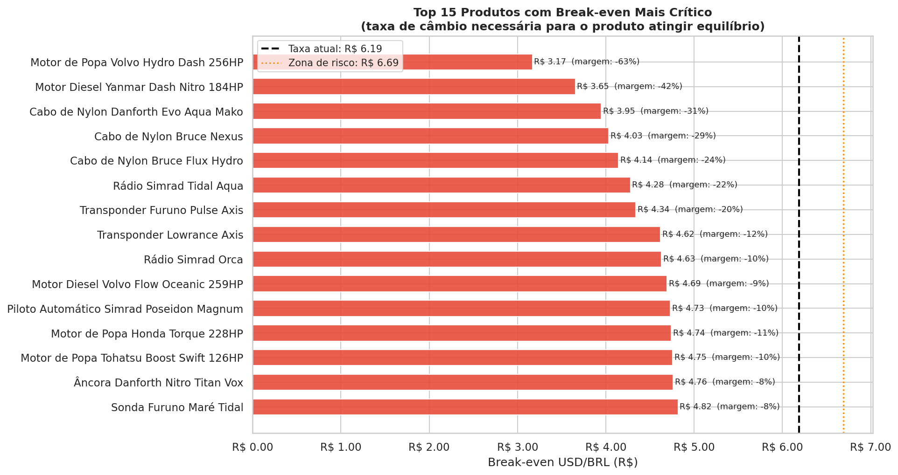

> **Onde encontrar:** `notebooks/06_analise_vendas.ipynb` — Seção 6, gráfico "Top 15 Produtos com Break-even Mais Crítico"

**Insight:** O break-even de todos os 150 produtos está abaixo do câmbio atual de R$6,19. A linha vertical mostra onde a taxa atual corta — nenhum produto sobrevive.

| Cenário cambial | Taxa | Produtos positivos | Margem | Resultado |
|---|---|---|---|---|
| Atual | R$6,19 | 0/150 | -25,4% | R$-663M |
| Otimista | R$5,50 | 5/150 | -11,4% | R$-298M |
| Base | R$5,00 | 85/150 | -1,3% | R$-34M |
| Meta (mín. histórico) | R$4,72 | 139/150 | +4,4% | R$+114M |

---

#### 3.4.5 Reajuste de Preço Necessário por Produto

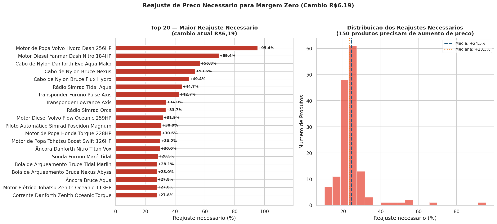

> **Onde encontrar:** `notebooks/06_analise_vendas.ipynb` — Seção 11 "Reajuste de Preço Necessário por Produto"

**Insight:** Com câmbio a R$6,19, **150/150 produtos precisam de reajuste**. Médio: **+24,5%** | Mediana: +23,3% | Máximo: **+95,4%** (Motor de Popa Volvo Hydro Dash 256HP). Este gráfico é a tabela de ação direta para a equipe comercial — mostra exatamente quanto cada produto precisa subir para atingir margem zero.

---

#### 3.4.6 Comparativo de Modelos de Previsão + Forecast Jan–Jun/2025

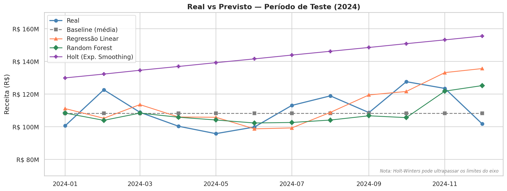

> **Onde encontrar:** `notebooks/08_previsao_demanda.ipynb` — Seção 8, gráfico "Real vs Previsto — Período de Teste (2024)"

| Modelo | MAPE | Observação |
|---|---|---|
| **Baseline (média)** | **8,1%** | ✅ Vencedor — forecast via Naive Sazonal (média × fator mensal) |
| Regressão Linear | 10,2% | 2º lugar |
| Random Forest | 8,8% | Overfitting (n=9 amostras) |
| Holt Exp. Smoothing | 30,5% | Tendência negativa degradou |
| Prophet (Meta) | 304,2% | Requer ≥2 ciclos anuais |

**Forecast Naive Sazonal — Jan a Jun/2025:**

| Mês | Previsão | IC Inferior | IC Superior |
|---|---|---|---|
| Jan/2025 | R$ 99,6M | R$ 83,8M | R$ 115,5M |
| **Fev/2025** | **R$ 121,4M** | R$ 105,5M | R$ 137,3M |
| Mar/2025 | R$ 107,8M | R$ 91,9M | R$ 123,6M |
| Abr/2025 | R$ 102,4M | R$ 86,5M | R$ 118,2M |
| Mai/2025 | R$ 101,3M | R$ 85,4M | R$ 117,2M |
| Jun/2025 | R$ 98,0M | R$ 82,2M | R$ 113,9M |

> Amplitude IC (~90%): ±R$15,9M. Fevereiro é o pico do semestre.
> ⚠️ Com margem atual de -5,3%, cada mês previsto implica prejuízo proporcional. O forecast é útil para estoque e equipe — não como meta financeira sem reajuste de preços.

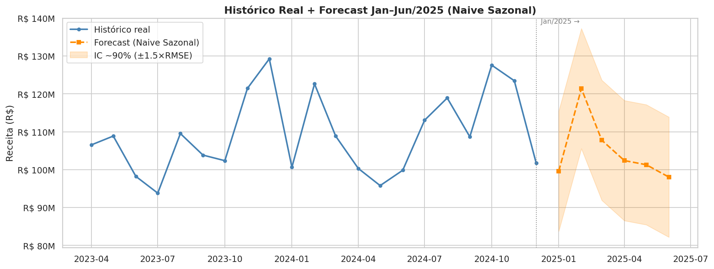

> **Onde encontrar:** `notebooks/08_previsao_demanda.ipynb` — Seção 9, célula de visualização do forecast

Histórico real 2023–2024 (azul) + projeção Naive Sazonal Jan–Jun/2025 (laranja pontilhado) + banda de confiança sombreada (±R$15,9M, ~90%). A linha vertical separa o histórico observado da projeção. Fevereiro/2025 é o pico projetado (R$121,4M), reflexo da sazonalidade histórica de Fev/2023 e Fev/2024.

---

#### 3.4.7 Segmentação RFM × Margem Real

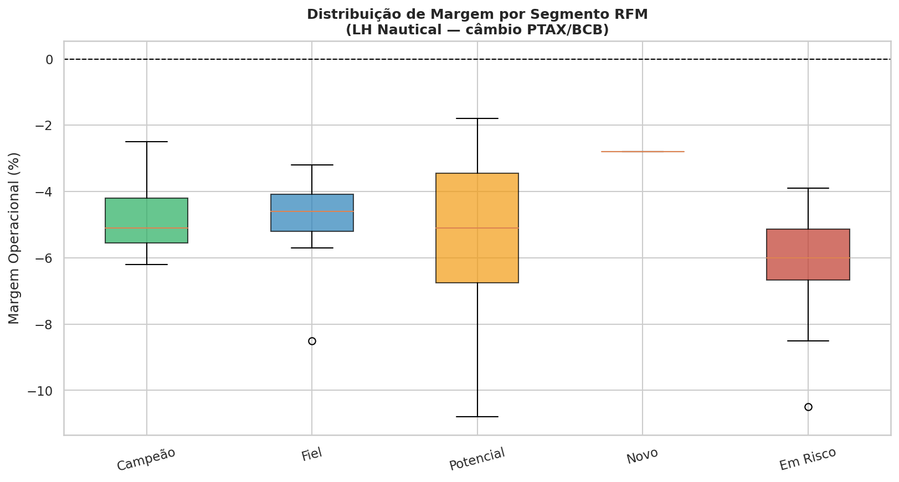

> **Onde encontrar:** `notebooks/07_analise_clientes.ipynb` — Seção 7, gráfico "Distribuição de Margem por Segmento RFM" (box plot por segmento)

| Segmento RFM | Clientes | Margem Média | Prioridade |
|---|---|---|---|
| Campeão | 7 | -4,8% | Retenção — menor prejuízo por venda |
| Fiel | 12 | -4,8% | — |
| Potencial | 19 | -5,4% | Maior grupo |
| Novo | 1 | -2,8% | — |
| **Em Risco** | **10** | **-6,3%** | 🔴 Urgente — risco de churn + pior margem |

**Insight:** Os 10 clientes "Em Risco" têm a pior margem do portfólio (-6,3%) e frequência declinante. São o dobro de problema: cada venda para eles gera prejuízo maior que a média, e podem parar de comprar. Campanha de retenção com negociação de preço (especialmente após reajuste) é prioritária.

---

## 4. Recomendações para a Campanha da Próxima Semana

| Prioridade | Ação | Dado que embasa |
|---|---|---|
| 🔴 Urgente | **Reajustar preços dos 127 produtos negativos** (início pelos de maior prejuízo absoluto) | 127/150 produtos com margem negativa. Reajuste médio necessário: +24,5% |
| 🔴 Urgente | **Priorizar os 23 produtos historicamente menos negativos** nas campanhas ativas | Menor impacto financeiro por venda enquanto os preços não são corrigidos |
| 🔴 Alta | Usar `recomendar_content_margem()` para direcionar cross-sell | Minimiza prejuízo incremental; 100% de cobertura (49/49 clientes) |
| 🔴 Alta | Campanha de retenção para os **10 clientes Em Risco** (RFM, margem -6,3%) | Risco duplo: churn iminente + pior margem do portfólio |
| 🟡 Média | Reforçar estoque de motores para **Fevereiro/2025** | Pico previsto: R$121,4M — maior mês do semestre |
| 🟢 Baixa | Expansão geográfica focada em **PA e BA** | Top 2 estados por receita; mercado já validado com alta recorrência |

---

## 5. Limites e Próximos Passos

### Limites
- Recorte histórico fechado: Jan/2023–Dez/2024. Com apenas 24 meses, modelos de previsão têm menor precisão para sazonalidade dupla ou tendências de longo prazo.
- Alta sensibilidade da margem ao câmbio: variação de R$0,50 no câmbio muda o resultado em ~R$132M anuais.
- Dependência de qualidade das fontes de origem: 4 bases brutas sem chave de integração explícita — o pipeline atual assume estabilidade dos formatos.
- Sistema de recomendação limitado pelo alto nível de completude do catálogo (densidade 73,6%): Precision@5 do melhor método CF (0,143) é inferior ao Random Baseline (0,167) — o valor real do sistema está no perfil de margem dos produtos recomendados, não no acerto preditivo.

### Próximos Passos

| Prazo | Ação |
|---|---|
| Imediato | Reajuste de preços baseado na tabela de break-even cambial por produto |
| Imediato | Ativar `recomendar_content_margem()` em campanhas — prioriza os 23 produtos historicamente menos negativos |
| 30 dias | Conectar sistema transacional ao financeiro para margem em tempo real por venda |
| 30 dias | Alerta automático quando taxa BCB superar break-even de cada produto |
| 90 dias | Orquestrar pipelines com Databricks Workflows — atualização automática diária |
| 6 meses | Com mais 1 ano de dados, os modelos de previsão ganharão precisão significativa |
| 1 ano | Com 3+ anos de histórico, SARIMA ou Prophet com sazonalidade completa se tornam viáveis |

---

## 6. Reprodutibilidade

```
1. git clone https://github.com/ASCCJR/Indicium_LH_Nautical.git
2. Importar notebooks/ para o Databricks Workspace
3. Executar notebooks 01 a 10 em sequência no Databricks
4. Confirmar "RUN_ALL CHECKS: PASS" ao final de cada etapa analítica
5. Opcional (local): streamlit run dashboard/streamlit_app.py
```

**Ambiente:** Databricks Runtime | PySpark | Delta Lake | pandas | scikit-learn | statsmodels | Prophet | Streamlit | Plotly

---

## 7. Repositório

[https://github.com/ASCCJR/Indicium_LH_Nautical](https://github.com/ASCCJR/Indicium_LH_Nautical)

---

## 8. Dashboard

[https://lh-nautical-dashboard.streamlit.app](https://lh-nautical-dashboard.streamlit.app) — execução local: `streamlit run dashboard/streamlit_app.py`

---

## Anexo A — Screenshots do Dashboard

### A.1 Visão Geral e KPIs

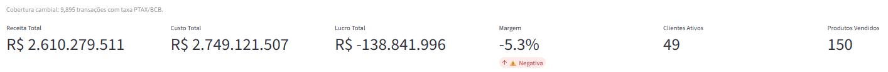

6 KPIs reativos aos filtros de ano/estado/categoria. Margem exibe alerta ⚠️ quando negativa — visível para qualquer combinação de filtros.

---

### A.2 Aba Resumo — Evolução com Câmbio

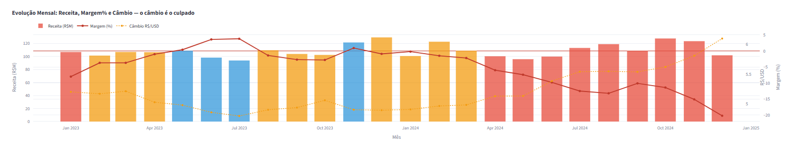

Barras coloridas por status de margem (azul = positiva, laranja = risco, vermelho = <−5%), linha de Margem% e câmbio no eixo direito. Os 4 meses azuis (Mai–Jul/2023 e Nov/2023) são os únicos com margem positiva — todos com câmbio abaixo de R$4,90. A partir de 2024, zero meses no azul: a depreciação do BRL destruiu completamente a margem, chegando a −20,2% em Dez/2024.

---

### A.3 Aba Produtos

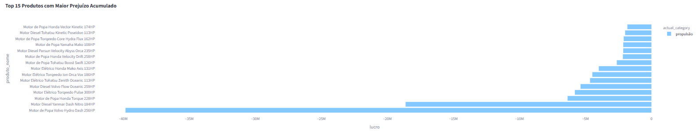

Ranking interativo dos 15 produtos com maior prejuízo acumulado. Filtrável por categoria — confirma a dominância de Propulsão no prejuízo total.

---

### A.4 Aba Clientes

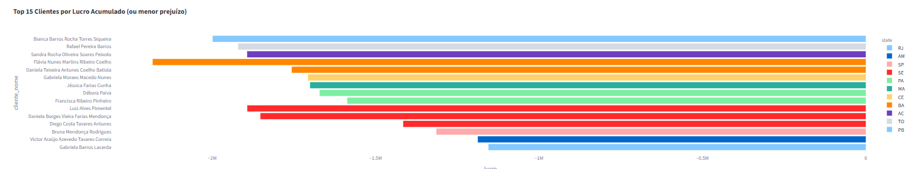

Nenhum cliente com lucro positivo — a crise é sistêmica. Ranking do menos negativo ao mais negativo, com cor por estado.

---

### A.5 Aba Previsão

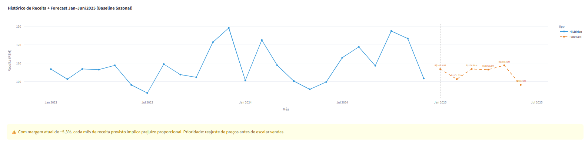

Histórico real (azul) + forecast Naive Sazonal (laranja pontilhado). Alerta de margem negativa integrado.

---

### A.6 Aba Recomendação

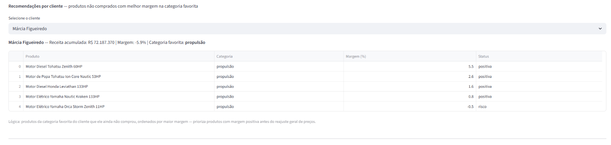

Exemplo com Márcia Figueiredo (maior cliente em receita, categoria favorita: Propulsão). Top 5 produtos recomendados priorizando margem positiva — 4 dos 5 com margem positiva (o 5º em zona de risco, −0,5%), demonstrando que o sistema direciona cross-sell para os produtos menos prejudiciais enquanto os preços não são reajustados.
