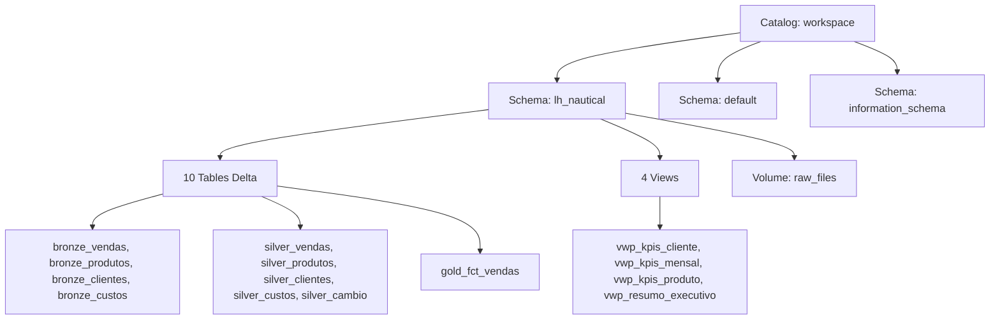
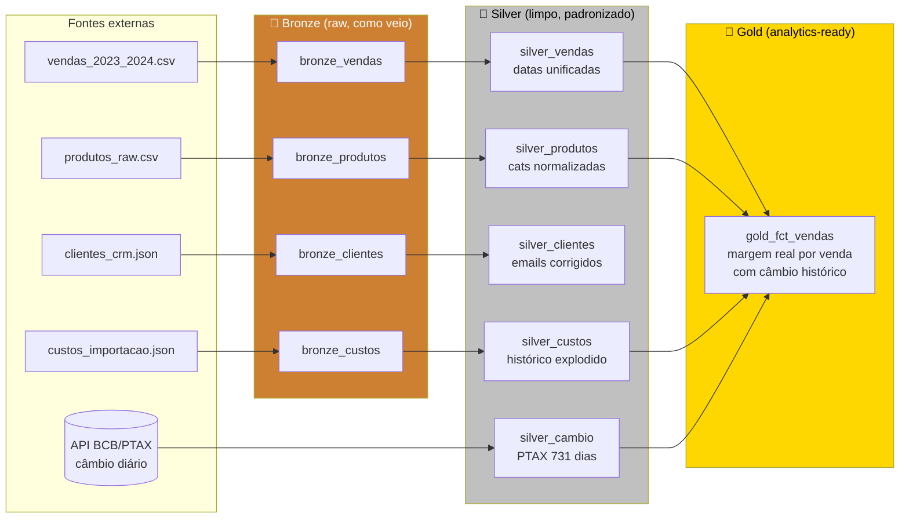
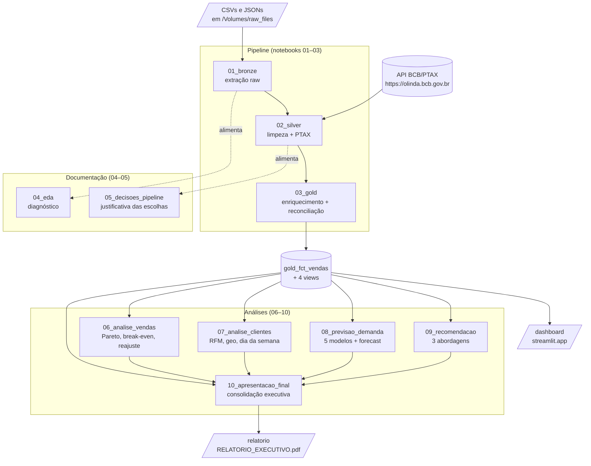

# GUIA do projeto LH Nautical

> Documento-memória. Lê isso aqui se voltar ao projeto depois de tempo sem mexer.
> Não é README (resumo público) nem business understanding (contexto de negócio) — é o **manual de operação técnica** do projeto.
>
> Para o "porquê do projeto" → [00_business_understanding.md](00_business_understanding.md)
> Para diretrizes de IA-pareada → `~/PROJETOS/CLAUDE.md` (global)

---

## Sumário

1. [O que é este projeto em 30 segundos](#1-o-que-é-este-projeto-em-30-segundos)
2. [Stack completo — o que cada ferramenta faz](#2-stack-completo)
3. [Estrutura de pastas](#3-estrutura-de-pastas)
4. [Arquitetura medallion](#4-arquitetura-medallion)
5. [Fluxo de dados ponta a ponta](#5-fluxo-de-dados-ponta-a-ponta)
6. [Notebooks 01–10: input/output de cada um](#6-notebooks-01-10-inputoutput-de-cada-um)
7. [Convenções de código](#7-convenções-de-código)
8. [Cheat sheet de comandos](#8-cheat-sheet-de-comandos)
9. [Onde está o quê no Databricks Workspace](#9-onde-está-o-quê-no-databricks-workspace)
10. [Conceitos fáceis de esquecer](#10-conceitos-fáceis-de-esquecer)
11. [Decisões registradas](#11-decisões-registradas)

---

## 1. O que é este projeto em 30 segundos

Pipeline analítico ponta a ponta no Databricks que partiu de **4 bases brutas** de uma empresa náutica fictícia (LH Nautical), integrou uma **5ª fonte externa** (API do Banco Central — câmbio diário PTAX) e revelou um achado invisível sem essa integração: **margem real de -5,3%** (~R$-139M de prejuízo em 2 anos). O custo de importação está em USD; sem converter pelo câmbio do dia da venda, a margem reportada parece artificial.

Entrega completa: pipeline Bronze → Silver → Gold em Delta Lake, dashboard Streamlit interativo, relatório executivo PDF, sistema de previsão de demanda, sistema de recomendação ajustado por margem.

**Status:** entregue como desafio técnico Indicium. Hoje é usado como **veículo de estudo** para skills de Analytics Engineer (dbt, modelagem dimensional, BI tools, orquestração) — sem prazo, com liberdade de experimentar.

---

## 2. Stack completo

Cada item explica: **o que é**, **por que está aqui**, **onde aparece no projeto**.

### 2.1 Databricks (plataforma analítica)

**O que é:** SaaS unificado para data engineering, analytics e ML. Você escreve notebooks Python/SQL/Scala, eles rodam em clusters Spark gerenciados (provisionamento automático, escala horizontal). Inclui Unity Catalog (governança), Delta Lake (formato de tabela), MLflow (tracking ML), Workflows (orquestração), Dashboards.

**Por que aqui:** o desafio técnico aceitava qualquer ferramenta de data lake; Databricks foi escolhido para mostrar competência na ferramenta principal usada pela Indicium (e mercado em geral pra workloads analíticos em escala).

**Onde aparece:**
- Os 10 notebooks rodam no Workspace Databricks (host: `dbc-ae4e7366-e4af.cloud.databricks.com`)
- Tabelas em `workspace.lh_nautical.*` (ver [seção 9](#9-onde-está-o-quê-no-databricks-workspace))
- Auth local via extensão Databricks no VS Code (metadata service em `127.0.0.1:51250`)

### 2.2 Unity Catalog

**O que é:** sistema de governança hierárquico do Databricks. Estrutura em 3 níveis: **Catalog → Schema → Table** (ou Volume, ou Function). Substitui o antigo Hive Metastore. Permite controle de acesso fino (tipo permissions de banco), lineage automático, descobrir dados via interface web.

**Por que aqui:** padrão moderno do Databricks. Sem Unity Catalog, você fica no modo "tabelas globais sem dono" — sem governança, sem lineage.

**Onde aparece:**
- Catalog: `workspace`
- Schema: `lh_nautical`
- Tables: `bronze_*`, `silver_*`, `gold_fct_vendas`, `vwp_*` (views)
- Volume: `raw_files` (CSVs/JSONs originais ficam aqui — `/Volumes/workspace/lh_nautical/raw_files/`)



### 2.3 Delta Lake

**O que é:** formato de armazenamento de tabelas que estende o Parquet com **transaction log** (pasta `_delta_log/` ao lado dos arquivos Parquet). Ganha:
- **ACID** (transações atômicas — commits binários)
- **Time travel** (consultar versões antigas: `VERSION AS OF 5`)
- **Schema evolution** (adicionar colunas sem reescrever)
- **MERGE / UPSERT** (operação atômica `MERGE INTO ... WHEN MATCHED ... WHEN NOT MATCHED`)
- **Z-ORDER / OPTIMIZE** (compactação inteligente)

**Por que aqui:** todas as tabelas do projeto são Delta. É o formato nativo do Databricks (criado por eles, hoje open source).

**Onde aparece:**
- Toda escrita em notebooks usa `.write.format("delta").saveAsTable(...)`
- Você vê em comentários como "Delta tables", "Delta format", "saveAsTable"

**Comparação rápida:**

| | Parquet | Delta |
|---|---|---|
| Formato físico | Arquivos `.parquet` | Arquivos `.parquet` + `_delta_log/` |
| ACID | ❌ | ✅ |
| Time travel | ❌ | ✅ |
| Schema evolution | Manual | ✅ Built-in |
| MERGE | ❌ | ✅ |
| Custo | Zero overhead | Pequeno overhead do log |

### 2.4 PySpark

**O que é:** API Python para o Apache Spark — engine de processamento distribuído. Você escreve código que parece pandas, mas roda em paralelo num cluster (vários nós).

**Conceito-chave: lazy evaluation.** Operações como `df.filter(...)`, `df.groupBy(...)` **não executam** — elas constroem um plano lógico. Só quando você chama uma **action** (`.show()`, `.count()`, `.collect()`, `.write...`) o plano vira código distribuído e roda.

**Por que aqui:** processar milhões de linhas seria lento em pandas single-thread. PySpark distribui automaticamente.

**Onde aparece:**
- Todos os 10 notebooks importam PySpark
- Padrões repetidos: `spark.read.csv(...)`, `spark.table(...)`, `df.write.format("delta")...`
- Algumas operações usam `.toPandas()` no final (notebooks analíticos) para usar bibliotecas Python clássicas (matplotlib, sklearn)

### 2.5 Asset Bundle vs Repos (2 modos de deploy)

Databricks tem **2 modos** de levar código local pro Workspace:

#### Modo Asset Bundle (CLI-based)
- Configurado via [databricks.yml](../databricks.yml)
- Comando: `databricks bundle deploy --target dev`
- Workspace path: `/Workspace/Users/<user>/.bundle/<bundle-name>/<target>/files/`
- Bom para: pipelines de produção, CI/CD, deploy declarativo

#### Modo Repos (Git-based) ✅ usado neste projeto
- Linka uma pasta do Workspace direto a um repo Git (GitHub/GitLab/etc.)
- Comando local: nenhum — você dá `git push` e clica "Pull" no Workspace
- Workspace path: `/Workspace/Users/<user>/<repo-name>/` (tipo `REPO`)
- Bom para: dev colaborativo, versionamento direto

**No nosso projeto:** está em Repos (linkado ao [github.com/ASCCJR/Indicium_LH_Nautical](https://github.com/ASCCJR/Indicium_LH_Nautical)). O `.bundle/` que você vê no Workspace é estrutura auxiliar criada pela extensão VS Code, mas o **deploy efetivo é via Git Pull**.

### 2.6 databricks-connect

**O que é:** biblioteca Python que permite **rodar PySpark localmente**, mas a execução acontece num cluster Databricks remoto. Você sente que tá rodando local, mas o trabalho pesado é remoto.

**Como funciona:**
1. Você importa `from databricks.connect import DatabricksSession`
2. Cria sessão: `spark = DatabricksSession.builder.serverless().getOrCreate()`
3. Usa `spark` exatamente como dentro do Databricks Runtime
4. Por baixo: cliente envia plano lógico via gRPC; cluster executa; resultado volta

**Por que aqui:** permite editar/debugar notebooks no VS Code (com Pylance, autocomplete, quebra-pontos) sem precisar abrir o Workspace.

**Onde aparece:** versão `databricks-connect==15.4.21` no [pyproject.toml](../pyproject.toml). Notebooks 04–10 têm boilerplate try/except detectando se estão no Runtime ou no databricks-connect:

```python
try:
    spark  # já existe no Databricks Runtime
    ...
except NameError:
    from databricks.connect import DatabricksSession
    spark = DatabricksSession.builder.serverless().getOrCreate()
```

### 2.7 jupytext (sync .ipynb ↔ .py)

**O que é:** ferramenta que mantém um notebook Jupyter (`.ipynb`) **sincronizado** com um arquivo Python plano (`.py`) usando marcadores `# %%` para separar células.

**Por que aqui:** a IA (Claude Code) edita melhor `.py` (texto puro) do que `.ipynb` (JSON com cells, metadata, outputs codificados em base64). O jupytext deixa os 2 lados em sincronia: você edita qualquer um, sincroniza, ambos refletem.

**Onde aparece:**
- Pareamento já configurado em todos os 10 notebooks (metadata `jupytext.formats: ipynb,py:percent`)
- Cada `.ipynb` tem um `.py` espelhado em `notebooks/`
- Comando de sync: `uv run python -m jupytext --sync notebooks/XX.py`

**⚠️ Limitação:** jupytext **não suporta** o formato nativo Databricks (`# Databricks notebook source` + `# COMMAND ----------`). Por isso usamos `py:percent` — basta lembrar que o `.py` é só pra IA editar; o `.ipynb` continua sendo a fonte uploadada ao Workspace.

### 2.8 uv (gestão de dependências Python)

**O que é:** gerenciador de pacotes/projetos Python da Astral. Substitui pip + venv + pyproject.toml setup manual. Lockfile determinístico de verdade. **Ordens de magnitude mais rápido** que pip.

**Por que aqui:** padrão moderno (PEP 517/518). `pyproject.toml` é a fonte da verdade; `uv.lock` garante reprodutibilidade.

**Onde aparece:**
- [pyproject.toml](../pyproject.toml) — declara deps com 3 grupos: principal (`databricks-connect`), `dashboard` (`streamlit`, `pandas`, `plotly`), `dev` (`jupytext`, `ruff`)
- [uv.lock](../uv.lock) — lockfile (~108 KB)
- `.venv/` — ambiente local criado pelo uv (não versionado)

**Comandos do dia a dia:** ver [seção 8](#8-cheat-sheet-de-comandos).

### 2.9 Streamlit

**O que é:** framework Python que transforma scripts em apps web reativos. Você escreve `st.title("...")`, `st.dataframe(df)`, `st.plotly_chart(fig)` e ele monta o HTML/JS automaticamente.

**Por que aqui:** dashboard interativo público acessível por qualquer pessoa, sem instalação. Streamlit Community Cloud hospeda gratuitamente.

**Onde aparece:**
- [dashboard/streamlit_app.py](../dashboard/streamlit_app.py) — app
- [dashboard/requirements.txt](../dashboard/requirements.txt) — deps específicas do deploy (gerado via `uv export --only-group dashboard`)
- Deploy público: https://lh-nautical-dashboard.streamlit.app

**Convenção:** o app lê CSVs **via raw URL do GitHub** (com fallback pra arquivo local). Só os 3 CSVs do dashboard ficam versionados no Git como exceção (ver [seção 11](#11-decisões-registradas)).

### 2.10 BCB/PTAX API

**O que é:** API pública do Banco Central do Brasil que serve a taxa **PTAX** (taxa oficial de fechamento USD/BRL) do dia. Endpoint:
```
https://olinda.bcb.gov.br/olinda/servico/PTAX/versao/v1/odata/...
```

**Por que aqui:** custos de importação estão em USD. Sem converter pelo câmbio do **dia da venda**, a margem fica artificial. PTAX é a referência oficial usada pelo mercado/Receita.

**Onde aparece:**
- Notebook [02_silver](../notebooks/02_silver.py) faz a chamada e gera `silver_cambio` (1 linha por dia)
- O notebook [03_gold](../notebooks/03_gold.py) faz **as-of join** entre vendas e câmbio para gerar `taxa_brl` por venda
- Forward fill: dias sem cotação (fim de semana, feriados) usam o último valor disponível

---

## 3. Estrutura de pastas

```
Indicium_LH_Nautical/
├── docs/                       # documentação conceitual (você está aqui)
│   ├── 00_business_understanding.md   # contexto de negócio, glossário, decisões
│   └── GUIA.md                        # este arquivo
├── notebooks/                  # 10 notebooks .ipynb + .py espelhados
│   ├── 01_bronze.ipynb / .py          # extração raw → bronze
│   ├── 02_silver.ipynb / .py          # limpeza + integração PTAX
│   ├── 03_gold.ipynb / .py            # enriquecimento + reconciliação
│   ├── 04_eda.ipynb / .py             # diagnóstico (textual)
│   ├── 05_decisoes_pipeline.ipynb / .py   # documentação das escolhas
│   ├── 06_analise_vendas.ipynb / .py  # break-even, Pareto, reajuste
│   ├── 07_analise_clientes.ipynb / .py # RFM, geo, dia da semana
│   ├── 08_previsao_demanda.ipynb / .py # forecast 5 modelos
│   ├── 09_recomendacao.ipynb / .py    # 3 abordagens + variante margem
│   └── 10_apresentacao_final.ipynb / .py  # consolidação executiva
├── data/                       # estrutura medallion local
│   ├── bronze/                        # raw (não versionado)
│   ├── silver/                        # limpo (2 versionados como exceção)
│   └── gold/                          # analytics-ready (1 versionado)
├── dashboard/
│   ├── streamlit_app.py               # app Streamlit
│   └── requirements.txt               # versionado: deploy Streamlit Cloud
├── src/
│   └── __init__.py                    # placeholder (ver seção 11)
├── assets/img/                 # 31 PNGs (logos + screenshots dashboard + gráficos)
├── pdf_assets/
│   └── relatorio.css                  # CSS do relatório executivo
├── typings/
│   └── __builtins__.pyi               # stubs de spark/dbutils pro Pylance entender
├── .databricks/                # config da extensão Databricks (auth, bundle)
├── .vscode/settings.json       # markdown-pdf config + cell markers
├── databricks.yml              # Asset Bundle config
├── pyproject.toml              # dependências (uv)
├── uv.lock                     # lockfile uv (versionado)
├── .gitignore                  # ver seção 11 — usa wildcards pra permitir exceções
├── README.md                   # apresentação pública do projeto
├── RELATORIO_EXECUTIVO.md / .pdf  # relatório executivo (com CSS)
└── (sem CLAUDE.md aqui — usa o global em ~/PROJETOS/CLAUDE.md)
```

### Pastas que precisam de explicação:

**`assets/img/`** — todas as imagens referenciadas no README e RELATORIO_EXECUTIVO. 31 arquivos PNG: 16 prints do dashboard, 11 logos de stack (Databricks, Delta Lake, etc.), 4 gráficos analíticos (Pareto, evolução mensal, etc.).

**`pdf_assets/relatorio.css`** — folha de estilo aplicada ao [RELATORIO_EXECUTIVO.md](../RELATORIO_EXECUTIVO.md) quando você converte pra PDF via extensão Markdown PDF do VS Code. Define capa estilizada (`cover-page`, `cover-title`), tipografia Montserrat/Inter, blockquotes coloridos. Configurado em [.vscode/settings.json](../.vscode/settings.json).

**`typings/__builtins__.pyi`** — stub file para Pylance entender que `spark`, `dbutils`, `display`, `displayHTML`, `sqlContext` etc. existem no escopo global. **No Databricks Runtime** essas variáveis são injetadas automaticamente; **localmente** Pylance não sabe disso e marcaria como erro. Esse `.pyi` resolve.

**`.databricks/`** — quase tudo dentro é gerado pela extensão VS Code. Versionado: só `commit_outputs/` e `.gitignore`. Não-versionado: `.databricks.env` (auth), `bundle/dev/` (terraform interno).

---

## 4. Arquitetura medallion

Padrão de Lake design popularizado pelo Databricks: organize seus dados em 3 camadas progressivamente refinadas.



### Princípios da medallion

| Camada | Conteúdo | Quem lê? |
|---|---|---|
| **Bronze** | Dados como vieram da fonte. Nenhuma transformação além de adicionar timestamp de ingestão. | Engenharia, auditoria |
| **Silver** | Dados limpos: tipos corretos, deduplicados, padronizados, filtros básicos. **1 silver por fonte.** | Analytics engineering, data scientists |
| **Gold** | Dados prontos pra consumo: agregados, enriquecidos, joinados, com KPIs calculados. | Negócio, dashboards |

**Regras inquebráveis:**
1. Dados só **avançam de camada**, nunca retrocedem. Silver não escreve em bronze.
2. Cada camada **depende** apenas da imediatamente anterior (silver lê só de bronze, gold lê só de silver).
3. Bronze é **imutável** (regravar exige drop + recreate, nunca update).

---

## 5. Fluxo de dados ponta a ponta



---

## 6. Notebooks 01–10: input/output de cada um

| # | Nome | Lê de | Escreve em | O que faz |
|---|------|-------|------------|-----------|
| 01 | `bronze` | Volume `raw_files` (4 CSVs/JSONs) | 4 tabelas `bronze_*` em Delta | Extração simples, schema-on-read |
| 02 | `silver` | 4 `bronze_*` + API PTAX | 5 tabelas `silver_*` | Limpeza, padronização, integração câmbio |
| 03 | `gold` | 5 `silver_*` | `gold_fct_vendas` + 4 views | As-of join cambial + reconciliação financeira |
| 04 | `eda` | 4 `bronze_*` | (textual) | Diagnóstico das 4 fontes brutas — problemas mapeados |
| 05 | `decisoes_pipeline` | `bronze_*` + `silver_*` | (textual) | Documenta cada decisão de limpeza com justificativa + valida silver |
| 06 | `analise_vendas` | `gold_fct_vendas` | gráficos PNG | Pareto, break-even cambial, reajuste necessário |
| 07 | `analise_clientes` | gold + silver_clientes | gráficos PNG | RFM, geolocalização, dia da semana |
| 08 | `previsao_demanda` | `gold_fct_vendas` | forecast Jan-Jun/2025 | 5 modelos (Naive, Linear, RF, Holt, Prophet) — Naive vence MAPE 8,1% |
| 09 | `recomendacao` | gold + silver | recomendações por cliente | User-CF, Item-CF, Content-Based + variante margem |
| 10 | `apresentacao_final` | gold + várias | gráficos consolidados | Consolida tudo num resumo executivo |

### Quem produz dado vs quem consome

- **Produzem dados** (passam pra próxima etapa): 01, 02, 03
- **Apenas consomem e geram gráficos/insights**: 04, 05, 06, 07, 08, 09, 10

Por isso só 01-03 têm bloco simples `=== RESUMO ===` (rowcounts + linhas por tabela). Os notebooks 04-10 têm `run_all_quality_checks_*()` que fazem invariantes do domínio (reconciliação financeira, integridade de joins, etc.).

---

## 7. Convenções de código

### 7.1 Naming

- **Tabelas:** `<camada>_<entidade>` snake_case → `silver_clientes`, `gold_fct_vendas`
- **Views:** prefixo `vwp_` → `vwp_kpis_mensal`
- **Variáveis Python:** snake_case → `vendas_gold`, `df_cambio`
- **Constantes:** ALL_CAPS → `RANDOM_STATE`, `CUTOFF`, `TOP_K`

### 7.2 `# PARAM:` markers

Hyperparâmetros e números mágicos têm comentário estruturado antes:

```python
# PARAM: RANDOM_STATE
# Semente para reprodutibilidade do Random Forest.
# 42 e o valor convencional na comunidade ML — qualquer int serve.
# Manter fixo garante que rodadas repetidas produzam o mesmo resultado.
RANDOM_STATE = 42
```

**Onde estão:**
- [08_previsao_demanda.py:80](../notebooks/08_previsao_demanda.py) — `RANDOM_STATE`
- [08_previsao_demanda.py:256](../notebooks/08_previsao_demanda.py) — `N_ESTIMATORS_RF`
- [09_recomendacao.py:75](../notebooks/09_recomendacao.py) — `TOP_K`, `N_SIMILARES`
- [09_recomendacao.py:437](../notebooks/09_recomendacao.py) — `CUTOFF` do split temporal

### 7.3 Contratos entre etapas (`run_all_quality_checks_*`)

Notebooks 04-10 terminam com função `run_all_quality_checks_<contexto>()` que retorna PASS/FAIL para invariantes específicas do estágio. Padrão:

```python
def run_all_quality_checks_<contexto>(df_a, df_b, ...):
    checks = {
        'reconciliacao_financeira': np.isclose(receita - custo - lucro, 0, atol=1e-2),
        'integridade_join': df_a['id'].isin(df_b['id']).all(),
        ...
    }
    qa = pd.DataFrame({'check': checks.keys(), 'status': checks.values()})
    qa['resultado'] = qa['status'].map({True: 'PASS', False: 'FAIL'})
    return qa
```

Ao final, sempre imprime `RUN_ALL CHECKS (ETAPA X): PASS` ou `FAIL`.

### 7.4 Boilerplate de compatibilidade Runtime vs databricks-connect

Notebooks 04-10 começam com:

```python
try:
    spark  # já existe no Databricks Runtime
    dbutils.widgets.text("catalog", "workspace", "Catalog")
    dbutils.widgets.text("schema", "lh_nautical", "Schema")
    CATALOG = dbutils.widgets.get("catalog")
    SCHEMA = dbutils.widgets.get("schema")
except NameError:
    from databricks.connect import DatabricksSession
    spark = DatabricksSession.builder.serverless().getOrCreate()
    CATALOG = "workspace"
    SCHEMA = "lh_nautical"
```

Detecta o ambiente e configura `spark` + widgets de catálogo/schema. Não foi extraído para `src/` (ver [seção 11.4](#114-por-que-srcutilspy-está-vazio)).

---

## 8. Cheat sheet de comandos

### 8.1 uv (gestão de dependências)

```bash
# Sincronizar ambiente com tudo (databricks-connect + dashboard + dev)
uv sync --all-groups

# Adicionar dep ao projeto principal
uv add <pacote>

# Adicionar dep a um grupo
uv add --group dashboard <pacote>
uv add --dev <pacote>          # atalho para grupo "dev"

# Rodar comando dentro do venv sem ativar
uv run python script.py
uv run streamlit run dashboard/streamlit_app.py

# Regenerar dashboard/requirements.txt (necessário antes de cada deploy Streamlit Cloud)
uv export --format requirements-txt --only-group dashboard --no-hashes \
  --no-emit-project --no-emit-workspace -o dashboard/requirements.txt
```

### 8.2 jupytext (sync .py ↔ .ipynb)

```bash
# Pareando notebook novo (só na primeira vez)
uv run python -m jupytext --set-formats ipynb,py:percent notebooks/XX.ipynb

# Sincronizar (depois de editar .py)
uv run python -m jupytext --sync notebooks/XX.py

# Sync em lote (todos)
for nb in notebooks/*.py; do uv run python -m jupytext --sync "$nb"; done
```

> **No Windows:** o binário `jupytext.exe` é bloqueado por política de Application Control. Sempre use `python -m jupytext`.

### 8.3 Databricks (auth + workspace)

```bash
# Ver profiles configurados
databricks auth profiles

# Quem você é
databricks current-user me

# Listar conteúdo do Workspace
databricks workspace list /Workspace/Users/<user>/

# Asset Bundle (deploy)
databricks bundle validate
databricks bundle deploy --target dev
databricks bundle run <job_name>
```

### 8.4 Git (semantic commits)

```bash
# Estrutura: tipo: descrição no imperativo
git commit -m "feat: adiciona modelo dim_produto"
git commit -m "fix: corrige timezone em silver_cambio"
git commit -m "docs: atualiza GUIA com seção de orquestração"
git commit -m "refactor: extrai boilerplate Spark pro src/"
git commit -m "chore: bump dbt-databricks pra 1.8"
```

Tipos válidos: `feat`, `fix`, `docs`, `refactor`, `test`, `chore`.

### 8.5 Streamlit (dashboard local)

```bash
# Rodar local
uv run streamlit run dashboard/streamlit_app.py

# Sem abrir browser automaticamente
uv run streamlit run dashboard/streamlit_app.py --server.headless=true

# Porta customizada
uv run streamlit run dashboard/streamlit_app.py --server.port=8502
```

---

## 9. Onde está o quê no Databricks Workspace

```
/Workspace/
└── Users/antoniosergiok@gmail.com/
    ├── Indicium_LH_Nautical/         ← REPO linkado ao GitHub (✅ canonical)
    │   ├── notebooks/                  ← rodam daqui no Workspace
    │   ├── dashboard/
    │   ├── data/                       ← dados sincronizados do Git
    │   └── ... (todos os arquivos do repo)
    └── .bundle/Indicium_LH_Nautical/   ← estrutura Asset Bundle (auxiliar)
        └── .output/dev/                  ← deploy artifacts (vazio se não usar bundle)
```

### Tabelas Delta + Volume

```
workspace                       (catalog)
└── lh_nautical                 (schema)
    ├── bronze_vendas           (Delta managed)
    ├── bronze_produtos
    ├── bronze_clientes
    ├── bronze_custos
    ├── silver_vendas
    ├── silver_produtos
    ├── silver_clientes
    ├── silver_custos
    ├── silver_cambio
    ├── gold_fct_vendas
    ├── vwp_kpis_cliente        (view)
    ├── vwp_kpis_mensal         (view)
    ├── vwp_kpis_produto        (view)
    ├── vwp_resumo_executivo    (view)
    └── raw_files               (Volume managed)
        ├── vendas_2023_2024.csv
        ├── produtos_raw.csv
        ├── clientes_crm.json
        └── custos_importacao.json
```

**Acesso via SQL:**
```sql
SELECT * FROM workspace.lh_nautical.gold_fct_vendas LIMIT 10;
SHOW TABLES IN workspace.lh_nautical;
DESCRIBE TABLE EXTENDED workspace.lh_nautical.gold_fct_vendas;
```

**Acesso via PySpark:**
```python
df = spark.table("workspace.lh_nautical.gold_fct_vendas")
df = spark.read.csv("/Volumes/workspace/lh_nautical/raw_files/vendas_2023_2024.csv")
```

---

## 10. Conceitos fáceis de esquecer

### 10.1 Catalog vs Schema vs Table

Hierarquia em 3 níveis no Unity Catalog:

| Nível | Equivalência mental | Exemplo neste projeto |
|---|---|---|
| **Catalog** | "Ambiente" (prod, dev, staging) | `workspace` |
| **Schema** | "Banco" ou "namespace" | `lh_nautical` |
| **Table/View/Volume** | "Tabela" | `gold_fct_vendas` |

Sempre referencie tabelas com 3 partes: `catalog.schema.table`.

### 10.2 Delta vs Parquet

Delta = Parquet **+ pasta `_delta_log/`** com transaction log. O log torna o Parquet versionado, ACID, evolutivo. Sem o log, é Parquet puro.

### 10.3 Driver vs Worker (Spark)

- **Driver:** processo coordenador. Executa código Python "comum" (variáveis locais, prints), constrói plano lógico Spark, envia para workers.
- **Worker:** processo que executa as tarefas (filter, groupBy, joins distribuídos) em paralelo nas partições dos dados.

Quando você faz `df.toPandas()`, **todos os dados são puxados pro driver** — pode estourar memória se a tabela for grande.

### 10.4 Lazy evaluation (Spark)

```python
df = spark.table("foo").filter(col("ano") == 2024).groupBy("estado").count()
# ⬆ Nada executou ainda — só construiu plano

df.show()
# ⬆ AGORA roda: otimiza o plano, distribui, executa
```

Por isso debugar Spark é diferente de pandas: erros podem aparecer só na **action** (`.show()`, `.collect()`, `.write...`).

### 10.5 As-of join (temporal join)

Tipo especial de join que casa duas tabelas pelo **valor mais recente** de uma coluna temporal. Usado em [03_gold](../notebooks/03_gold.py) para casar cada venda com o **último custo USD vigente** até a data da venda.

```sql
-- Pseudocódigo
SELECT v.*, c.usd_price
FROM vendas v
ASOF LEFT JOIN custos c
  ON v.product_id = c.product_id
  AND v.sale_date >= c.effective_date
```

### 10.6 Forward fill

Operação que **preenche valores faltantes** propagando o último valor não-nulo para frente. Usado em [02_silver](../notebooks/02_silver.py) — fim de semana e feriado não têm cotação PTAX, então herdam a do dia útil anterior.

```python
df["taxa_brl"] = df["cotacaoVenda"].ffill().bfill()
```

### 10.7 Reconciliação financeira

Validação automática de que `receita - custo - lucro ≈ 0` em **todas** as linhas (com tolerância R$0,01 para arredondamento). Captura bugs de cálculo de margem antes que cheguem no dashboard.

### 10.8 Break-even cambial

A taxa USD/BRL na qual o produto **deixa de dar lucro**. Calculada por produto:
```
break_even = preço_venda / (qtd_unitário_USD × markup_alvo)
```

Se câmbio atual > break-even → produto opera no prejuízo.

### 10.9 RFM (Recency, Frequency, Monetary)

Segmentação clássica de clientes em 3 dimensões:
- **R**ecency: há quanto tempo comprou pela última vez (menor = melhor)
- **F**requency: quantas vezes comprou (maior = melhor)
- **M**onetary: valor total gasto (maior = melhor)

Cada dimensão vira score 1-5; combinação define segmento (Champion, Loyal, At Risk, etc.).

### 10.10 MAPE (Mean Absolute Percentage Error)

Métrica de erro de previsão, em %:
```
MAPE = mean(|real - previsto| / |real|) × 100
```

Bom para comparar séries de magnitudes diferentes (ao contrário do MAE/RMSE absolutos). Naive Sazonal venceu com 8,1% — significa erro médio de ~8% no período de teste.

### 10.11 Naive Sazonal (baseline forecast)

Previsão simples: para cada mês futuro, estima como `média_histórica × fator_sazonal_do_mês`. Bom baseline porque é difícil de bater com 24 meses de dados (modelos complexos overfittam).

### 10.12 PTAX

Taxa oficial de câmbio USD/BRL divulgada pelo Banco Central. Calculada às 13h diariamente, com base em cotações do mercado interbancário. **PTAX de venda** (compra de USD) é o que importa pra importação.

---

## 11. Decisões registradas

### 11.1 Por que jupytext `py:percent` e não Databricks source format?

Jupytext **não suporta nativamente** o formato Databricks source (`# Databricks notebook source` + `# COMMAND ----------`). Suporta `py:percent` (`# %%`), `py:light`, etc. Como o `.ipynb` é a fonte da verdade (uploadada ao Workspace via Repos), o `.py` serve **só para a IA editar localmente** — não precisa ser upload-ready ao Databricks.

### 11.2 Por que `dashboard/requirements.txt` é versionado mas `requirements.txt` na raiz não é?

Streamlit Community Cloud **exige `requirements.txt`** no caminho do app pra instalar deps no deploy. `pyproject.toml` ainda não é detectado por todos os runners. Solução:
- Raiz: sem `requirements.txt` (fonte de verdade é `pyproject.toml` + `uv.lock`)
- `dashboard/requirements.txt`: versionado, gerado via `uv export --only-group dashboard`, contém **só** as deps do dashboard (não do projeto inteiro)

### 11.3 Por que 3 CSVs estão versionados em `data/silver/` e `data/gold/`?

O dashboard lê os CSVs via raw URL do GitHub para evitar dependência de banco rodando 24/7. 3 CSVs precisam estar acessíveis publicamente:
- `data/gold/vendas_gold.csv` (~836 KB)
- `data/silver/produtos_clean.csv` (~8 KB)
- `data/silver/clientes_clean.csv` (~5 KB)

Como `.gitignore` exclui `data/silver/*` e `data/gold/*`, esses 3 ficam como exceção (`!data/silver/produtos_clean.csv`, etc.).

### 11.4 Por que `src/utils.py` está vazio?

CLAUDE.md diz "Funções reutilizáveis vão pro `src/`". Mas, ao auditar este projeto:
- `format_money`/`format_pct` aparecem **só no dashboard** — não há outro consumidor
- Formatadores matplotlib são lambdas inline (`lambda v, _: f'R$ {v:.0f}M'`) — não vale extrair
- Constantes de cor são notebook-específicas
- **O único candidato real** é o boilerplate Databricks Runtime vs databricks-connect (repete em 7 notebooks). Mas extrair pra `src/` exige sync via Asset Bundle e ajuste de `sys.path` no cluster — overhead arquitetural maior que o ganho

Decisão: deixar `src/__init__.py` como placeholder. Quando dbt for adicionado, faz mais sentido — modelos dbt já têm reuso natural (macros, tests).

### 11.5 Por que dbt **não** está aqui ainda?

dbt vai entrar como **estudo de longo prazo**. Plano sugerido:
- **Fase A**: aprender dbt Fundamentals (curso oficial, gratuito)
- **Fase B**: criar pasta `dbt/` no projeto, configurar `dbt-databricks` adapter
- **Fase C**: migrar `02_silver` PySpark → dbt models que leem das tabelas bronze
- **Fase D**: migrar `03_gold` PySpark → dbt models + adicionar dbt tests
- **Fase E**: refatorar gold em star schema (`dim_produto`, `dim_cliente`, `dim_tempo`, `fct_vendas`)

Não foi feito ainda porque o usuário ainda está estudando dbt fundamentos.

### 11.6 Por que sem `.devcontainer/`?

Existia mas foi removido. Configurava um GitHub Codespaces para rodar o dashboard automaticamente. Como o usuário não usa Codespaces neste projeto específico, manter um `.devcontainer/` quebrado (apontava pra `requirements.txt` que não existe mais) era pior que não ter.

### 11.7 Por que `RELATORIO_EXECUTIVO.pdf` está versionado mesmo sendo gerado?

PDF é o **artefato final** entregue à Indicium no desafio técnico. Versionar garante que qualquer pessoa que clone o repo veja o resultado sem precisar do VS Code + extensão Markdown PDF para gerar.

---

## Referências externas

| Tópico | Link |
|---|---|
| Databricks Workspace | https://dbc-ae4e7366-e4af.cloud.databricks.com |
| Repo GitHub | https://github.com/ASCCJR/Indicium_LH_Nautical |
| Dashboard ao vivo | https://lh-nautical-dashboard.streamlit.app |
| BCB/PTAX docs | https://olinda.bcb.gov.br/olinda/servico/PTAX/versao/v1/aplicacao |
| Delta Lake docs | https://docs.delta.io/ |
| dbt Fundamentals (curso) | https://courses.getdbt.com/courses/fundamentals |
| jupytext docs | https://jupytext.readthedocs.io/ |
| uv docs | https://docs.astral.sh/uv/ |
